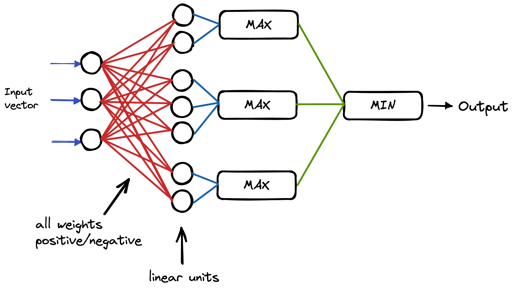

# Monotonic Neural Networks - How to achieve monotonicity in a Neural Network

This repository is a review of methods used to achieve monotonicity in a Neural Network (NN) with the implementations in Python (PyTorch).

## How to achieve monotonicity?

According to the literature, there are two classes of methods used:
1. Hard constraints: using a special NN architecture, etc.
2. Soft constraints: using a a custom loss function that penalizes non-monotonicity, etc.

The main advantage of using a hard constraint is the guarantee that the output will be monotone. However, it is often hard to implement and too restrictive.

The main advantage of using a soft constraint is the flexibility. However, there is no guarantee of the monotonicity of the output.

## "Monotonic Neural Network" by Joseph Sill
Reference paper: [Monotonic Neural Networks](https://proceedings.neurips.cc/paper_files/paper/1997/file/83adc9225e4deb67d7ce42d58fe5157c-Paper.pdf)

The first method we explored is the Monotonic Neural Network by Joseph Sill in 1997. Sill proposed a novel NN architecture that imposes the monotonicity of the output by setting the weights to be positive (negative) if the input variable is increasing (decreasing) and a special two-layer : Min and Max. These two subsequent layers are able to capture the convexity and concavity of the function.

The following schema represents the proposed architecture:

The code is available at [models/monNN.py](models/monNN.py) with a Jupyter Notebook at [mon_NN.ipynb](mon_NN.ipynb).

Some related work: [Monotonic MLP](https://github.com/tiwalayo/monotonic-mlp)

## "Monotone and partially monotone neural networks" by Daniels and Velikova
Reference paper: [Monotone and partially monotone neural networks](https://pubmed.ncbi.nlm.nih.gov/20371402/)

This methods proposes a modification of Sill's monotonic NN by unconstraining weights of variables that are non-monotonic. 

The following schema represents the architecture:
.

The code is available at [models/partmonNN.py](models/partmonNN.py) with a Jupyter Notebook at [part_mon_NN.ipynb](part_mon_NN.ipynb).

## Non-monotonicity penalizing loss function
Both preivous methods applied a hard constraint on the monotonicity of the neural network. However, if we want the NN to be flexible to be used with other functions we have to implement a custom loss function. 

This loss function penalizes non-motonic behaviours for the monotonic subset variables of the inputs variables of the function. In other words, it computes the directional derivative with respect to the monotone variables and penalizes if it is negative.

The code is available at [models/monLoss.py](models/monLoss.py) with a Jupyter Notebook at [mon_loss.ipynb](mon_loss.ipynb).